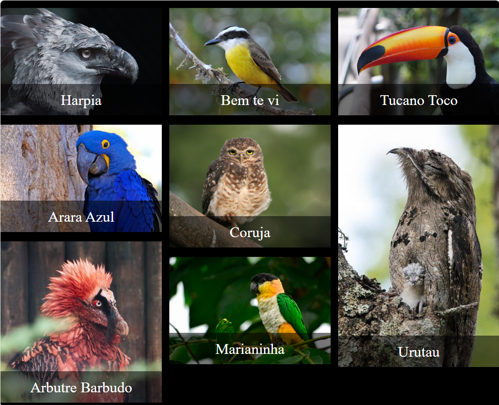

# 10-Galeria-JavaScript

Projeto de galeria desenvolvido como uma introdução ao acesso de imagens utilizando objetos JSON e criação de elementos por meio do JavaScript.

## Layout

## Tecnologias utilizadas:

* HTML
* CSS
* JavaScript

## Autor
[Edvan Alves](<https://br.linkedin.com/in/edvan-alves>)